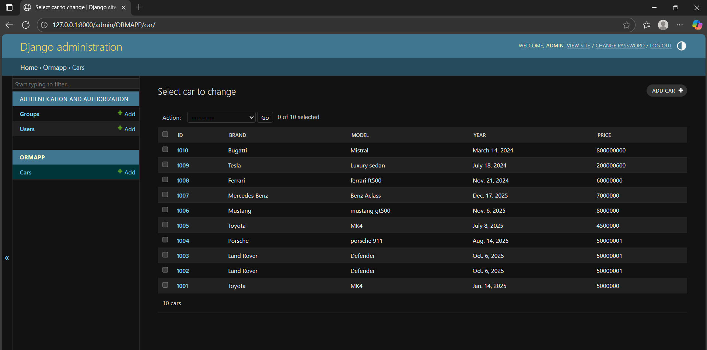

# Ex02 Django ORM Web Application
## Date: 24.09.2025

## AIM
To develop a Django application to store and retrieve data from Car Inventory Database using Object Relational Mapping(ORM).

## ENTITY RELATIONSHIP DIAGRAM


## DESIGN STEPS

### STEP 1:
Clone the problem from GitHub

### STEP 2:
Create a new app in Django project

### STEP 3:
Enter the code for admin.py and models.py

### STEP 4:
Execute Django admin and create details for 10 books

## PROGRAM
```
models.py
from django.db import models
from django.contrib import admin

class Car(models.Model):
    id = models.IntegerField(primary_key=True)
    brand = models.CharField(max_length=15)
    model = models.CharField(max_length=30)
    year = models.DateField()
    price = models.IntegerField()

class CarAdmin(admin.ModelAdmin):
    list_display = ('id','brand','model','year','price')
```

```
from django.contrib import admin
from . models import Car, CarAdmin

# Register your models here.
admin.site.register(Car, CarAdmin)
```


## OUTPUT



## RESULT
Thus the program for creating a database using ORM hass been executed successfully
